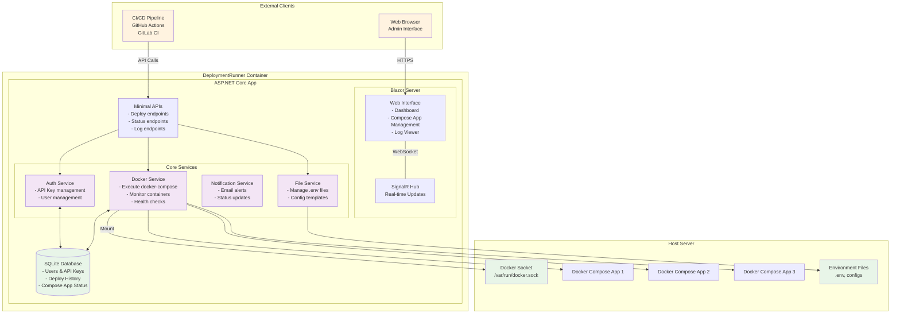

# 🚀 OnPremCompose (DeploymentRunner)

A modern, containerized service for centralized Docker Compose deployment management with real-time monitoring and web interface.

## 🎯 Overview

OnPremCompose provides a comprehensive solution for managing Docker Compose deployments across your infrastructure. It combines a powerful REST API for CI/CD integration with an intuitive web interface for manual management, all while providing real-time monitoring and notifications.

## ✨ Key Features

- **🔗 Minimal API** for seamless CI/CD integration
- **🌐 Blazor Server** web interface with real-time updates  
- **📡 SignalR** for live logs and deployment status
- **🐳 Multi-Engine Support** for local and remote Docker engines
- **📧 Email Notifications** for deployment events and alerts
- **🔐 API Key Management** for secure automation
- **💓 Health Monitoring** with automatic alerts and recovery
- **⚡ One-Click Installation** via Docker container

## 🏗️ Architecture



## 🚀 Quick Start

### Prerequisites
- Docker & Docker Compose installed
- Linux/Windows Server with Docker socket access

### Installation

1. **Download the deployment configuration:**
```bash
curl -o docker-compose.yml https://raw.githubusercontent.com/BernhardPollerspoeck/OnPremCompose/main/docker/docker-compose.yml
```

2. **Start the service:**
```bash
docker-compose up -d
```

3. **Access the web interface:**
   - Open `http://your-server:5000`
   - Create initial admin user on first login

### CI/CD Integration

Deploy compose applications via the REST API:

```bash
curl -X POST http://your-server:5000/api/deploy \
  -H "Authorization: Bearer YOUR_API_KEY" \
  -H "Content-Type: application/json" \
  -d '{
    "serviceName": "my-app",
    "composeFile": "version: \"3.8\"\nservices:\n  web:\n    image: nginx:latest",
    "environment": {
      "ENV": "production"
    }
  }'
```

## 📋 API Endpoints

| Method | Endpoint | Description |
|--------|----------|-------------|
| POST | `/api/deploy` | Deploy or update a compose application |
| GET | `/api/services` | List all managed compose applications |
| GET | `/api/services/{name}` | Get compose application details |
| GET | `/api/services/{name}/logs` | Stream compose application logs |
| DELETE | `/api/services/{name}` | Stop and remove compose application |
| POST | `/api/services/{name}/restart` | Restart compose application |
| GET | `/api/health` | Health check endpoint |

**Authentication**: All API requests require an API key in the Authorization header:
```
Authorization: Bearer YOUR_API_KEY
```

### 📝 Terminology Clarification

OnPremCompose manages **Docker Compose applications** (complete deployments), not individual containers or compose services:

- **Compose Application/Deployment**: A complete Docker Compose deployment managed by OnPremCompose (referenced as `{name}` in API endpoints)
- **Compose Service**: Individual services defined within a `docker-compose.yml` file (e.g., `web`, `database`, `redis`)
- **Service Container**: Running instances of compose services

Example: A "my-app" deployment might contain `web`, `api`, and `database` compose services, each running in their own containers.

## ⚙️ Configuration

### Environment Variables

| Variable | Description | Default |
|----------|-------------|---------|
| `ASPNETCORE_ENVIRONMENT` | Environment (Development/Production) | `Production` |
| `Email__SmtpHost` | SMTP server hostname | - |
| `Email__SmtpPort` | SMTP server port | `587` |
| `Email__Username` | SMTP username | - |
| `Email__Password` | SMTP password | - |
| `Docker__SocketPath` | Docker socket path | `/var/run/docker.sock` |

### Docker Compose Example

```yaml
version: '3.8'
services:
  deployment-runner:
    image: onpremcompose:latest
    ports:
      - "5000:80"
    volumes:
      - /var/run/docker.sock:/var/run/docker.sock:ro
      - ./data:/app/data
      - ./configs:/app/configs
    environment:
      - ASPNETCORE_ENVIRONMENT=Production
      - Email__SmtpHost=smtp.gmail.com
      - Email__Username=your-email@gmail.com
      - Email__Password=your-app-password
```

## 🔐 Security Features

- **Docker Socket Access**: Secure container management with read-only socket access
- **API Key Authentication**: Strong API keys with rotation capabilities
- **Role-based Access Control**: Permission-based user management
- **TLS Encryption**: HTTPS for all communications
- **File Permissions**: Proper volume mount security

## 📊 Monitoring & Alerts

- **Real-time Health Checks**: Continuous monitoring of compose applications and their containers
- **Email Notifications**: Instant alerts for deployment events and failures
- **Live Log Streaming**: Real-time log viewing via web interface
- **Performance Metrics**: Compose application health and performance tracking
- **Automatic Recovery**: Self-healing capabilities for failed containers and services

## 📚 Documentation

For detailed technical information, see:
- [📋 Full Documentation](readme_main.md) - Complete user guide and API reference
- [🏗️ Architecture Details](architecture_doc.md) - In-depth technical architecture

## 🤝 Contributing

1. Fork the repository
2. Create a feature branch
3. Commit your changes
4. Push to the branch
5. Create a Pull Request

## 📄 License

This project is licensed under the MIT License - see the [LICENSE](LICENSE) file for details.

## 🆘 Support

- 🐛 [Issue Tracker](https://github.com/BernhardPollerspoeck/OnPremCompose/issues)
- 💬 [Discussions](https://github.com/BernhardPollerspoeck/OnPremCompose/discussions)