# 🏗️ Architecture Documentation

## Overview

DeploymentRunner is built as a modern ASP.NET Core application using Minimal APIs, Blazor Server, and SignalR for real-time communication. The application runs in a Docker container with access to the host's Docker socket for container management.

## Project Structure

```mermaid
graph TD
    subgraph "🏗️ DeploymentRunner.sln"
        subgraph "📁 src/"
            subgraph "📦 DeploymentRunner/"
                subgraph "📂 Program.cs"
                    PROGRAM["🚀 Program.cs<br/>• Minimal API Endpoints<br/>• DI Container Setup<br/>• SignalR Configuration<br/>• Authentication/Authorization"]
                end
                
                subgraph "📂 Models/"
                    MODELS["📋 Models<br/>• DeploymentRequest.cs<br/>• ServiceStatus.cs<br/>• ApiKey.cs<br/>• User.cs<br/>• DockerComposeConfig.cs"]
                end
                
                subgraph "📂 Services/"
                    DOCKER_SVC["🐳 DockerService.cs<br/>• Docker Compose execution<br/>• Health checks<br/>• Container status monitoring<br/>• Log collection"]
                    
                    FILE_SVC["📄 FileService.cs<br/>• Environment file management<br/>• Config template processing<br/>• Backup creation<br/>• File validation"]
                    
                    NOTIFY_SVC["📧 NotificationService.cs<br/>• Email alerts<br/>• Deployment notifications<br/>• Health check alerts<br/>• Template management"]
                    
                    AUTH_SVC["🔐 AuthService.cs<br/>• API key generation/validation<br/>• User authentication<br/>• Permission management<br/>• Session handling"]
                    
                    DEPLOY_SVC["🚀 DeploymentService.cs<br/>• Orchestrates deployments<br/>• Rollback functionality<br/>• Deployment history<br/>• Progress tracking"]
                end
                
                subgraph "📂 BackgroundServices/"
                    HEALTH_BG["💓 HealthMonitorService.cs<br/>• Continuous health monitoring<br/>• Auto-restart failed services<br/>• Performance metrics<br/>• Alert triggering"]
                    
                    CLEANUP_BG["🧹 CleanupService.cs<br/>• Log rotation<br/>• Old deployment cleanup<br/>• Temp file management<br/>• Database maintenance"]
                end
                
                subgraph "📂 Components/ (Blazor)"
                    PAGES["📄 Pages/<br/>• Dashboard.razor - Overview<br/>• Services.razor - Service mgmt<br/>• Deployments.razor - Deploy history<br/>• Settings.razor - Configuration<br/>• Logs.razor - Real-time logs"]
                    
                    COMPONENTS["🧩 Shared/<br/>• ServiceCard.razor<br/>• DeploymentProgress.razor<br/>• LogViewer.razor<br/>• ApiKeyManager.razor"]
                end
                
                subgraph "📂 Hubs/"
                    HUB["🔄 DeploymentHub.cs<br/>• Real-time deployment updates<br/>• Live log streaming<br/>• Service status changes<br/>• Progress notifications"]
                end
                
                subgraph "📂 Data/"
                    DB_CONTEXT["🗄️ ApplicationDbContext.cs<br/>• SQLite Entity Framework<br/>• User/ApiKey entities<br/>• Deployment history<br/>• Service configurations"]
                    
                    MIGRATIONS["📋 Migrations/<br/>• Database schema<br/>• Initial data seeding<br/>• Version management"]
                end
                
                subgraph "📂 Extensions/"
                    EXTENSIONS["⚙️ Extensions<br/>• ServiceCollectionExtensions.cs<br/>• MinimalApiExtensions.cs<br/>• DockerExtensions.cs<br/>• ValidationExtensions.cs"]
                end
                
                subgraph "📂 Configuration/"
                    CONFIG["⚙️ Configuration<br/>• DockerSettings.cs<br/>• EmailSettings.cs<br/>• SecuritySettings.cs<br/>• appsettings.json"]
                end
            end
        end
        
        subgraph "📁 docker/"
            DOCKERFILE["🐳 Dockerfile<br/>• Multi-stage build<br/>• .NET 8 runtime<br/>• Docker CLI installation<br/>• Security hardening"]
            
            COMPOSE["📋 docker-compose.yml<br/>• Runner service definition<br/>• Volume mounts<br/>• Environment variables<br/>• Network configuration"]
        end
        
        subgraph "📁 scripts/"
            INSTALL["📜 install.sh<br/>• One-click installation<br/>• Docker verification<br/>• Initial setup<br/>• Service registration"]
        end
    end

    classDef service fill:#e3f2fd
    classDef background fill:#f3e5f5
    classDef ui fill:#e8f5e8
    classDef data fill:#fff3e0
    classDef config fill:#fce4ec
    
    class DOCKER_SVC,FILE_SVC,NOTIFY_SVC,AUTH_SVC,DEPLOY_SVC service
    class HEALTH_BG,CLEANUP_BG background
    class PAGES,COMPONENTS,HUB ui
    class DB_CONTEXT,MIGRATIONS data
    class CONFIG,EXTENSIONS config
```



## Core Components

### 1. Minimal API Layer

The application uses ASP.NET Core Minimal APIs for all HTTP endpoints:

```csharp
// Deployment endpoints
app.MapPost("/api/deploy", DeploymentEndpoints.Deploy)
   .RequireAuthorization("ApiKey");

app.MapGet("/api/services", ServicesEndpoints.GetAll)
   .RequireAuthorization("ApiKey");

app.MapGet("/api/services/{name}/logs", ServicesEndpoints.StreamLogs)
   .RequireAuthorization("ApiKey");
```

### 2. Blazor Server UI

Real-time web interface with SignalR integration:

- **Dashboard**: Overview of all services and recent deployments
- **Services**: Detailed service management and configuration
- **Deployments**: Deployment history and rollback capabilities
- **Logs**: Real-time log streaming and filtering
- **Settings**: API key management and system configuration

### 3. Service Layer

#### DockerService
- Executes docker-compose commands
- Monitors container health and status
- Collects logs and metrics
- Manages docker networks and volumes

#### DeploymentService
- Orchestrates the deployment process
- Handles pre-deployment validation
- Manages rollback procedures
- Tracks deployment history and status

#### FileService
- Manages environment files and configurations
- Creates backups before updates
- Validates file formats and content
- Handles template processing

#### NotificationService
- Sends email alerts for deployment events
- Manages notification templates
- Handles retry logic for failed notifications
- Supports multiple notification channels

#### AuthService
- Manages API key generation and validation
- Handles user authentication and sessions
- Enforces permission-based access control
- Provides JWT token management

### 4. Background Services

#### HealthMonitorService
- Continuously monitors service health
- Triggers alerts for unhealthy services
- Collects performance metrics
- Attempts automatic recovery

#### CleanupService
- Rotates logs based on retention policies
- Cleans up old deployment artifacts
- Manages database maintenance tasks
- Handles temporary file cleanup

### 5. Data Layer

Uses Entity Framework Core with SQLite for:
- User and API key storage
- Deployment history tracking
- Service configuration persistence
- Audit logging

## Communication Flow

### API Requests
1. CI/CD pipeline sends deployment request
2. AuthService validates API key
3. DeploymentService validates request
4. DockerService executes deployment
5. Real-time updates sent via SignalR
6. Email notifications sent on completion

### Web Interface
1. User accesses Blazor UI
2. Real-time updates via SignalR Hub
3. Background services push status updates
4. UI automatically refreshes with new data

## Security Architecture

### Authentication & Authorization
- JWT-based API authentication
- Role-based access control
- API key scoping and permissions
- Session management for web UI

### Container Security
- Non-root user execution
- Read-only file system where possible
- Minimal base image (Alpine/Distroless)
- Security scanning in CI pipeline

### Network Security
- TLS encryption for all communications
- Network isolation between services
- Firewall-friendly port configuration
- Optional VPN integration

## Scalability Considerations

### Horizontal Scaling
- Stateless API design
- External database support (PostgreSQL/MySQL)
- Load balancer compatibility
- Distributed caching support

### Performance Optimization
- Async/await throughout the application
- Connection pooling for database access
- Efficient SignalR hub management
- Background task optimization

## Monitoring & Observability

### Logging
- Structured logging with Serilog
- Log levels and filtering
- External log aggregation support
- Performance logging

### Metrics
- Health check endpoints
- Custom metrics collection
- Integration with monitoring tools
- Performance counters

### Tracing
- Distributed tracing support
- Request correlation IDs
- Performance profiling
- Error tracking

## Deployment Patterns

### Blue-Green Deployment
- Maintains two identical environments
- Instant rollback capabilities
- Zero-downtime deployments
- Health check validation

### Rolling Updates
- Gradual service updates
- Configurable update strategies
- Automatic rollback on failure
- Load balancer integration

### Canary Deployments
- Percentage-based traffic routing
- A/B testing capabilities
- Gradual rollout monitoring
- Risk mitigation strategies
